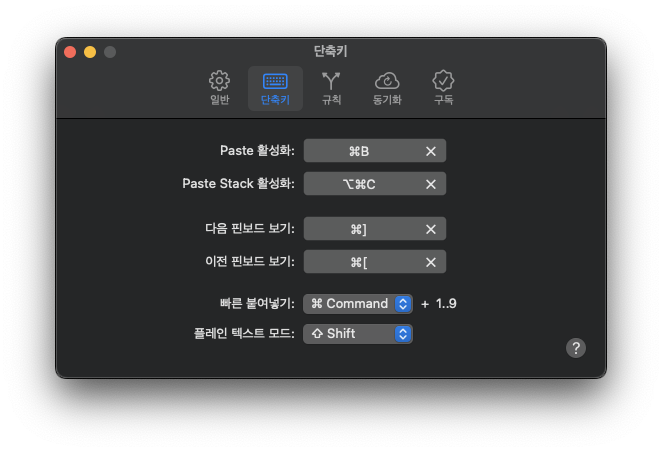

맥을 처음 사용하는 분들께 추천하는 프로그램입니다.

<!--truncate-->

## 마우스, 키보드관련

### [CursorSense](https://www.plentycom.jp/en/cursorsense/index.html)

마우스 가속도 제거

  
추천 설정

### [Mos](https://mos.caldis.me)

마우스 스크롤 방향 전환 및 가속도 제거

  
추천 설정

### Karabiner

키보드 매핑 변경

  
추천 설정

## Setapp

### iStat Menus

시스템 상태 자세히보기

  
추천 설정

### CleanMyMac X

최적화 프로그램

### Bartendar

상단 바 아이콘 숨기기

### CleanShot X

스크린샷

  
추천 설정

### Paste

클립보드 저장

  
추천 설정

