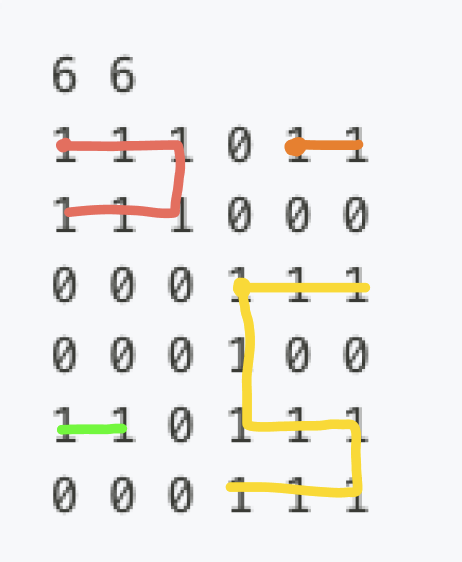

주어진 배열에서 연속되는 1의 덩어리의 개수를 구하는 문제입니다.
동일한 덩어리라는 것을 판단하고, 저장하기 위해서, `areaMap`이라는 배열을 추가로 사용하였습니다.

```c title="areaMap" showLineNumbers
int areaMap[NUM][NUM] = {}; // 밝혀진 영역 저장
```

---

배열을 순회하면서, 아직 영역이 밣혀지지 않은 지뢰를 만나면, `clarify_area` 함수를 호출하여 영역을 밝힙니다.

```c title="get_mine" showLineNumbers
int get_mine(int m, int n) {
    int result = 0;

    for (int i = 0; i < m; i++) {
        for (int j = 0; j < n; j++) {
            int isMine = grid[i][j] == 1;
            int area = areaMap[i][j];
            // 지뢰이고, 밝혀진 영역이 아닌 경우
            if (isMine && area == 0) {
                int num = clarify_area(m, n, i, j, ++result);
            }
        }
    }
    return result;
}
```

---

`clarify_area` 함수는 재귀적으로 호출되며, 현재 위치에서 상하좌우로 이동하면서, 영역을 밝힙니다.
맵 밖인 경우, 땅이 아닌 경우, 이미 밝혀진 영역인 경우에는 재귀를 종료합니다.
위 문제에서는 영역의 크기가 필요하지 않지만, 영역의 크기를 구하고 싶다면, `clarify_area` 함수의 반환값을 이용할 수 있도록 구현하였습니다.

```c title="clarify_area" showLineNumbers
int clarify_area(int m, int n, int i, int j, int areaNum) {
    // 맵 밖인 경우
    if (i < 0 || i >= m || j < 0 || j >= n)
        return 0;

    // 땅이 아닌 경우
    if (grid[i][j] == 0)
        return 0;

    // 이미 밝혀진 영역인 경우
    if (areaMap[i][j] != 0)
        return 0;

    areaMap[i][j] = areaNum;

    return clarify_area(m, n, i, j - 1, areaNum) + // 왼쪽
           clarify_area(m, n, i, j + 1, areaNum) + // 오른쪽
           clarify_area(m, n, i - 1, j, areaNum) + // 위
           clarify_area(m, n, i + 1, j, areaNum) + // 아래
        1;
}
```

---

다음 예제에 대한 Call Stack은 다음과 같습니다.

```
6 6
1 1 1 0 1 1
1 1 1 0 0 0
0 0 0 1 1 1
0 0 0 1 0 0
1 1 0 1 1 1
0 0 0 1 1 1
```

```

clarify_area(0, 0, 1)
└─ clarify_area(0, 1, 1)
   └─ clarify_area(0, 2, 1)
      └─ clarify_area(1, 2, 1)
         └─ clarify_area(1, 1, 1)
            └─ clarify_area(1, 0, 1)

clarify_area(0, 4, 2)
└─ clarify_area(0, 5, 2)

clarify_area(2, 3, 3)
├─ clarify_area(2, 4, 3)
│   └─ clarify_area(2, 5, 3)
└─ clarify_area(3, 3, 3)
    └─ clarify_area(4, 3, 3)
        └─ clarify_area(4, 4, 3)
            └─ clarify_area(4, 5, 3)
                └─ clarify_area(5, 5, 3)
                    └─ clarify_area(5, 4, 3)
                        └─ clarify_area(5, 3, 3)

clarify_area(4, 0, 4)
└─ clarify_area(4, 1, 4)
```



---

다음은 전체 코드입니다.

```c title="main.c" showLineNumbers
#include <stdio.h>
#define NUM 300
int grid[NUM][NUM] = {};
int areaMap[NUM][NUM] = {}; // 밝혀진 영역 저장

int clarify_area(int m, int n, int i, int j, int areaNum) {
    // 맵 밖인 경우
    if (i < 0 || i >= m || j < 0 || j >= n)
        return 0;

    // 땅이 아닌 경우
    if (grid[i][j] == 0)
        return 0;

    // 이미 밝혀진 영역인 경우
    if (areaMap[i][j] != 0)
        return 0;

    areaMap[i][j] = areaNum;

    return clarify_area(m, n, i, j - 1, areaNum) +
           clarify_area(m, n, i, j + 1, areaNum) +
           clarify_area(m, n, i - 1, j, areaNum) +
           clarify_area(m, n, i + 1, j, areaNum) + 1;
}

int get_mine(int m, int n) {
    int result = 0;

    for (int i = 0; i < m; i++) {
        for (int j = 0; j < n; j++) {
            int isMine = grid[i][j] == 1;
            int area = areaMap[i][j];
            // 지뢰이고, 밝혀진 영역이 아닌 경우
            if (isMine && area == 0) {
                int num = clarify_area(m, n, i, j, ++result);
            }
        }
    }
    return result;
}

int main() {
    /* DO NOT MODIFY */
    int i = 0, j = 0, m = 0, n = 0, result = 0;

    scanf("%d %d", &m, &n);
    for (i = 0; i < m; i++) {
        for (j = 0; j < n; j++) {
            scanf("%d", &grid[i][j]);
        }
    }

    result = get_mine(m, n);
    printf("%d\n", result);
    /* DO NOT MODIFY */
}
```

위 코드는 [Google C++ Style Guide](https://google.github.io/styleguide/cppguide.html)에 의해 포매팅되었으며,
GPT 및 여타 AI 모델을 이용하지 않고 작성되었습니다.
