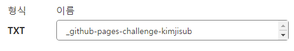
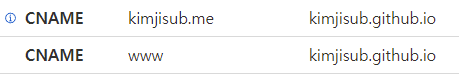

Github Page로 Docusaurus 문서를 배포하던 도중 커스텀 도메인 연결이 끊어져버리는 문제가 발생하였다.
[공식 문서][공식 문서]를 찾아보니 별도의 도메인 인증이 있어야 도메인 탈취로부터 안전하다는 것을 알게 되었다.
아래 내용은 Github Page를 위한 도메인 인증부터 레포지토리 등록까지의 과정이다.

## Github 계정 설정에서 도메인 인증 받기

[링크][도메인 인증]에 대한 내용입니다.

1. Github 설정 페이지에서 도메인을 입력하고, TXT 레코드를 복사한다.
2. 구매한 도메인의 DNS 설정 페이지에서 TXT 레코드를 입력한다.

3. Verify를 눌러 도메인을 인증한다.

## DNS 설정하기

사용하고 싶은 호스트네임으로 `CNAME` `<github id>.github.io`를 등록한다.

## Github 레포지토리 Page에 도메인 등록하기

1. 해당 레포지토리 설정에서 Page 설정을 완료한다.
2. DNS에 등록했던 호스트네임을 입력하고 저장을 한다.

[공식 문서]: https://docs.github.com/en/pages/configuring-a-custom-domain-for-your-github-pages-site

[도메인 인증]: https://docs.github.com/en/pages/configuring-a-custom-domain-for-your-github-pages-site/verifying-your-custom-domain-for-github-pages