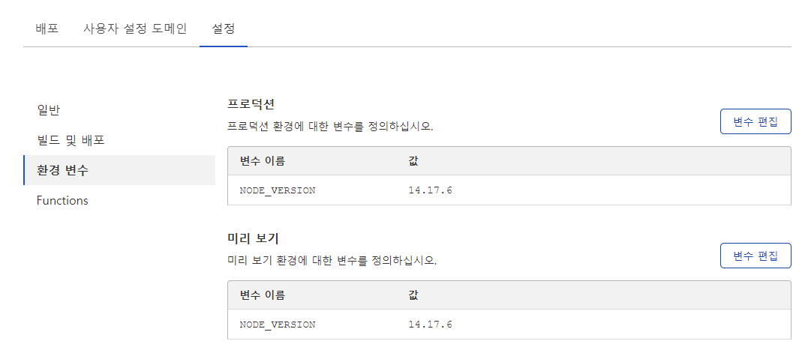

최근 cloudflare에 추가된 기능들 중 웹페이지를 쉽게 빌드하여 배포할 수 있도록 도와주는
Pages 기능에 대해서 알아보겠다.

<!--truncate-->

## 배경

이전까지 Firebase Hosting, Github Pages, 자체 서버 deploying 등 다양한 방법으로 웹 프론트 페이지를 배포해왔었다.
Firebase hosting의 경우 군부대 사지방에서 접속이 안되는 문제가 있었고, Github Pages는 설정상의 오류인지 자꾸 custom domain 연결이 해제되는 문제가 있었다.
Docker와 ssh를 이용한 방법은 꽤나 안정적이였지만, 정전이나 서버 다운 시 직접 복구작업을 해주어야 했다.
또한 이러한 방법들 모두 Github Action을 이용한 CI/CD workflows를 정의해주고 잘 작동하는지 테스트하는 것도 꽤 힘든 작업이였다.
Cloudflare에 추가된 Pages 기능을 이용하면 간단하게 레포지토리 선택과 build 명령어, deploy 폴더만 지중해주면 손쉽게 웹 프론트 페이지를 deploy할 수 있게 되었다.
최근 Docusaurus를 이용하여 개인 포트폴리오 페이지를 만들고 있는데, Cloudflare Pages를 이용하여 배포하던 도중 알게 된 것들을 정리해보았다.

## Version 변경

https://developers.cloudflare.com/pages/platform/build-configuration

