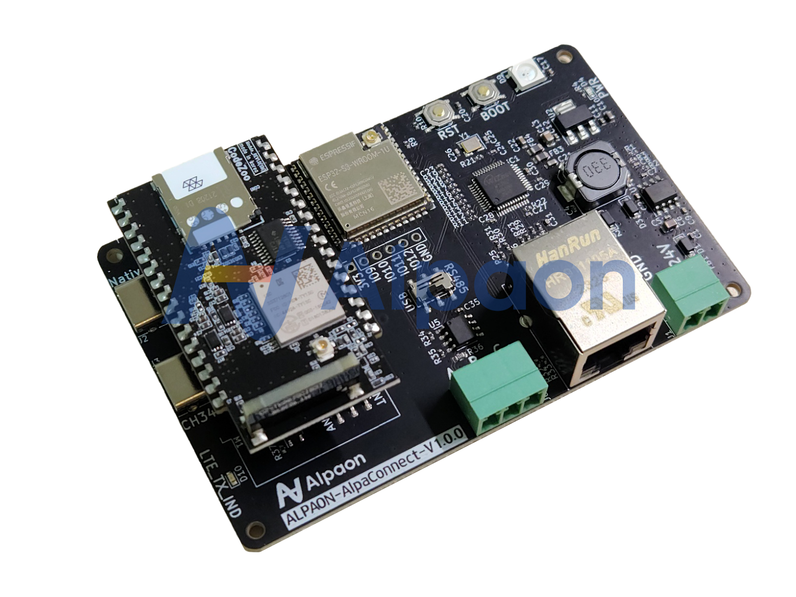

# AlpaConnect

산업용 Cloud IoT

1. 사업 개요
알파온 유한책임회사는 혁신적인 산업 자동화 솔루션을 제공하는 기업으로, 고객이 기계의 운영 효율성을 극대화하고 원격 관리의 현대화를 실현할 수 있도록 지원합니다. 당사는 APC(AlpaConnector)라는 고유의 PCB 기술과 이와 함께 사용되는 AlpaConnect 서비스를 통해 산업 자동화 분야에서 독보적인 제품을 개발하고 있습니다.

1. 문제 인식 및 해결 방안
현장 접근 의존성: 현재 작업자들은 장비를 조작하기 위해 물리적으로 현장에 있어야만 합니다. 이는 제어 패널을 수동으로 조작해야 한다는 것을 의미하며, 이러한 접근 방식은 유연성을 저해하고 시간 및 자원의 낭비를 초래합니다.

상주 인원 필요성: 장비 문제 발생 시 즉각적인 대응을 위해 현장에 상주 인원이 필요합니다. 이는 인건비 증가를 비롯한 추가 비용을 발생시키며, 비효율적인 인력 관리 문제로 이어질 수 있습니다.

데이터 활용 미흡: 장비에서 생성되는 다양한 센서 데이터가 충분히 활용되지 않고 있습니다. 유의미한 정보를 제공할 수 있는 많은 데이터가 적절한 분석 없이 소홀히 처리되고 있습니다.

1. 해결 방안
원격 제어 도입: 원격 제어 기능을 도입함으로써 작업자가 어디에 있든지 장비를 효과적으로 제어할 수 있습니다. 이는 작업의 유연성을 대폭 향상시키고 현장 접근 의존성을 감소시킵니다.

인력 비용 절감: 원격 모니터링 시스템을 통해 상주 인원 없이도 장비를 관리할 수 있게 되어 인건비가 절감됩니다. 이는 운영 비용의 전반적인 감소로 이어집니다.

데이터 수집 및 분석 강화: 고급 데이터 수집 및 분석 도구를 사용하여 장비에서 생성되는 데이터를 실시간으로 수집하고 분석합니다. 이를 통해 데이터를 의사결정에 효과적으로 활용할 수 있습니다.

1. 제품/서비스 소개

[자체 개발 PCB “APC”]

APC는 당사가 자체적으로 개발한 PCB로, 기계에 장착된 PLC와 통신하여 데이터를 읽고 쓰는 기능을 제공합니다. 이 장치는 고객의 기계를 스마트 기기로 전환시켜, 제품의 성능을 최적화하고 운영 효율성을 높이는 역할을 합니다. APC는 쉽게 설치할 수 있으며, 기계의 PLC와 신속하게 통합되어 고객이 기계의 상태를 실시간으로 파악하고, 원격에서 직접 제어할 수 있도록 합니다.

APC 장치의 기본 사양과 가격은 다음과 같습니다:

1. AlpaConnect 서비스
AlpaConnect는 APC 장치와 함께 사용되는 소프트웨어 서비스로, 앱 형태로 제공됩니다. 이 앱을 통해 고객은 APC를 통해 클라우드로 전송된 데이터를 실시간으로 모니터링 할 수 있으며, 언제 어디서든 원격 제어를 통해 APC에 명령을 내릴 수 있습니다. 이는 사용자에게 더 나은 접근성과 편리함을 제공하며, 시스템의 유연성을 향상시킵니다. AlpaConnect는 사용자가 필요로 하는 데이터 분석, 보고서 생성, 알림 설정 등의 다양한 기능도 지원합니다.

이 두 가지 제품은 고객에게 기계 운영의 현대화, 자동화 및 원격 관리의 편의성을 제공함으로써, 고객의 비즈니스 운영을 효율적으로 만들어주는 종합 솔루션입니다. APC의 신뢰성 있는 하드웨어와 AlpaConnect의 직관적인 소프트웨어 서비스의 결합은 고객에게 차별화된 가치를 제공하며, 이는 당사의 경쟁력을 더욱 강화시킵니다.

1. 시장 분석
LS 일렉트릭과의 비교:

점유율: LS 일렉트릭은 국내 시장에서 높은 점유율을 가지고 있지만, 그들의 장치 원격 관리는 VPN을 통한 전통적인 방식에 의존하고 있습니다. 이는 설정의 복잡성과 사용성 측면에서 사용자에게 불편을 초래할 수 있습니다.

사용자 친화성: LS 일렉트릭의 솔루션은 PC 기반의 제어에 한정되어 있어, 모바일이나 타블렛과 같은 다양한 디바이스를 사용하는 현대적인 사용자 환경에 적합하지 않습니다.

타이아와의 비교:

데이터 전송의 효율성: 타이아는 PLC에서 클라우드로 데이터를 전송하는 과정에서 여러 단계를 거치며, 이는 고객의 지출 증가와 데이터 처리의 비효율성을 야기합니다. 반면에 당사의 AlpaConnect 서비스에서는 자체 개발한 전용 PCB를 통해 PLC로부터 클라우드로 바로 데이터를 전송, 비용과 시간의 효율성을 제공합니다.

1. 문제 인식
1. APC (AlpaConnector)
1. 경쟁사 분석
하드웨어 및 운영체제: 당사의 서비스에 이용되는 자체 개발 장치 (APC)는 ESP32를 활용하여 운영체제 없이 독립적인 하드웨어 기반으로 운영되는 반면, 타이아는 Mini PC와 Windows 10 IoT를 사용합니다. ESP32의 사용은 저전력 소비, 높은 통합성, 그리고 신뢰성 있는 연결성을 제공하며, Windows 시스템에 비해 오류 발생 가능성이 적습니다.

1. 차별화 전략
손쉬운 클라우드 전환

우리의 플랫폼은 기존 산업용 장비를 대대적으로 교체할 필요 없이 클라우드 기능으로 업그레이드할 수 있게 합니다. 이는 비용 효율적인 전환 솔루션으로, 장비의 가치와 수명을 연장시킵니다.

기존 시스템과의 통합

Modbus 표준 프로토콜을 이용하여 다양한 장비와의 원활한 통합을 지원하며, 호환성 문제 없이 새로운 기능을 추가할 수 있습니다.

실시간 데이터 액세스 및 분석

장비로부터 실시간으로 데이터를 수집하고 분석하여, 사용자에게 즉각적인 인사이트를 제공합니다. 이는 예측 유지보수와 자원 배분 최적화에 필수적입니다.

원격 모니터링 및 제어

사용자는 언제 어디서나 모바일 및 웹 인터페이스를 통해 장비를 모니터링하고 제어할 수 있습니다. 이는 운영의 유연성을 대폭 향상시킵니다.

맞춤형 경보 시스템

사용자 정의 경보 및 알림 시스템을 통해 잠재적 문제에 대응할 수 있으며, 이는 중단 시간을 최소화하고 운영 효율을 극대화합니다.

사용자 중심 디자인

직관적인 사용자 인터페이스를 통해 모든 사용자가 쉽게 시스템을 사용할 수 있도록 설계되었습니다. 이는 교육 및 적응 기간을 단축시킵니다.

확장성 및 맞춤 설정

고객의 요구에 맞춘 맞춤 설정이 가능하여, 비즈니스 성장에 따라 시스템을 확장할 수 있습니다.

이러한 가치 제안들은 우리 플랫폼이 산업 장비의 원격 관리와 데이터 활용에 있어서 획기적인 변화를 가져올 수 있음을 강조합니다.

1. 시장 규모 및 성장 가능성
IMARC Group의 리포트에 따르면, 전 세계 프로그래머블 로직 컨트롤러(PLC) 시장 규모는 2022년에 146억 달러(한화 약 19조)에 달했습니다. 이 시장은 2023년부터 2028년까지 연평균 성장률(CAGR) 5.38%로 성장하여 2028년에는 202억 달러(한화 약 26조)에 이를 것으로 전망된다고 하였습니다.

해당 시장은 지속적으로 발전하는 기술과 연결성의 흐름을 타고, 프로그래머블 로직 컨트롤러(PLC)와 사물인터넷(IoT) 간의 통합된 솔루션을 점점 더 필요로 하고 있습니다. 이는 공장의 자동화, 원격 모니터링 및 데이터 분석의 효율성을 향상시킬 수 있는 기회를 제공합니다. 따라서 당사가 추진하는 사업은 이러한 기술적 통합을 선도함으로써, 시장 내에서 높은 성장 잠재력을 가지고 있습니다. 당사의 혁신적인 접근 방식은 이 분야의 기술 발전을 촉진하고, 연결성을 강화하는 데 필수적인 역할을 하며, 이는 끊임없이 확장되는 시장에서 당사의 성장 가능성을 크게 확대시킬 것입니다.

1. 타겟 고객 분석
다음과 같은 고객층에 AlpaConnect 판매를 기대 할 수 있습니다:

1. 원격 모니터링 및 제어가 필요한 고객:
이 고객군은 특히 상주 인원이 부재할 때 장비의 가동을 지속할 수 있는 능력을 필수적으로 요구합니다. 원격 모니터링 및 제어 기능을 통해 실시간으로 액세스하고, 잠재적인 중단 없이 장비를 효율적으로 관리하고자 합니다.

1. 기존 판매중인 장비의 기능성 향상을 원하는 고객:
이 사용자들은 자신들이 현재 판매중인 장비에 추가적인 기능을 통합하여 부가 가치를 창출하길 원합니다. 자체 개발의 부담없이 당사 하드웨어를 추가하며 쉽게 업그레이드함으로써 기능성을 강화하고자 하는 고객에게 당사의 솔루션은 매력적인 옵션이 될 것입니다.

1. 데이터 수집 및 분석을 통해 운영 효율성을 높이고자 하는 고객:
데이터를 활용하여 운영의 효율성을 극대화하려는 고객은 당사의 제품에 큰 관심을 가질 것입니다. 이들은 장비로부터 수집된 데이터를 분석하고, 이를 통해 인사이트를 도출하며 의사결정 과정을 개선하고자 합니다.

1. 얼리 어답터:
혁신적인 기술을 빠르게 수용하고, 새로운 솔루션을 적용하여 경쟁 우위를 확보하려는 얼리 어답터들도 주요 타겟 고객입니다. 이들은 새로운 기술의 선구자로서, 당사의 최신 솔루션을 통해 시장에서 선도적인 위치를 차지하고자 합니다.

1. 24시간 운영이 필수적인 장비를 가진 회사:
예를 들어, 음식물 처리를 위해 미생물을 이용하는 장비를 운영하는 회사는 24시간 내내 장비를 모니터링하고 원격 관리할 수 있는 능력이 필수적입니다. 이러한 회사는 당사의 원격 관리 솔루션을 통해 비즈니스 연속성을 보장하고 생산성을 최적화할 수 있습니다.

1. 수익모델
당사의 수익 모델은 두 가지 주요 요소에 기반을 두고 있습니다: 하드웨어 판매와 지속적인 서비스 제공을 통한 라이선스 수익입니다.

하드웨어 판매 (APC 장치):

우리의 핵심 제품인 APC 장치는 PLC와 직접 연결되어 클라우드로 데이터를 전송하는 자체 제작 장치입니다. 이 장치는 고객이 필요로 하는 옵션에 따라 가격이 책정되며, 750,000원에서 1,000,000원 사이의 1회성 비용으로 판매됩니다. 이 초기 비용은 고객이 고성능의 원격 관리 기능을 가지는 우리의 첨단 장치를 소유하게 하는 것을 포함합니다.

서비스 라이선스 (AlpaConnect, AlpaCloud 이용료):

APC 장치와 함께, 고객은 당사의 AlpaConnect 서비스에 대한 연간 라이선스도 구매합니다. 이 라이선스는 고객에게 지속적인 클라우드 접근성, 데이터 분석, 원격 관리 기능과 같은 다양한 서비스를 제공합니다. 연간 이용료는 200,000원으로, 이는 고객이 당사의 클라우드 기반 서비스를 통해 지속적으로 가치를 얻을 수 있도록 보장합니다.

이러한 수익 모델은 단일 판매 이익과 지속적인 수익의 조합을 통해 회사의 재정적 안정성과 성장을 지원합니다. 하드웨어 판매에서 얻는 초기 수익은 지속적인 제품 개발과 서비스 개선에 재투자될 수 있으며, 라이선스 수익은 안정적인 현금 흐름을 제공하여 회사 운영에 기여합니다.

1. 마케팅 및 판매 전략
당사는 특화된 원격 제어 및 관리 솔루션을 통해 기업들이 기계의 효율성과 생산성을 극대화할 수 있도록 지원합니다. 이러한 서비스는 특히 기계에 내장된 PLC의 원격 모니터링과 관리가 필수적인 기업들에게 매우 가치 있는 제안입니다. 저희는 잠재 고객에게 직접 접근하여 당사의 서비스가 어떻게 그들의 비즈니스 운영을 강화시킬 수 있는지 구체적인 사례를 제시함으로써 수주를 확보하였습니다.

또한, 저희는 기계 판매 회사와 협력하여 당사의 원격 제어 및 관리 기능을 기계에 통합함으로써 그 가치를 더욱 높입니다. 이는 고객에게 추가적인 편의성과 성능 향상을 제공하는 동시에, 저희 서비스에 대한 수요를 증가시키는 전략입니다. 이와 같은 전략적 접근 방식은 저희 서비스의 시장 침투를 가속화하고 브랜드 인지도를 높이는 데 기여하고 있습니다.

1. 재무 계획
알파온 유한책임회사는 독립적인 자금 조달 전략을 성공적으로 실행해 오고 있습니다. 외부 투자자 없이, 당사의 제품 판매로부터 발생하는 선결제 자금을 통해 운용 자금을 조달하고 있습니다. 이는 우리의 자체 자금 조달 능력을 강화하고 사업 운영에 대한 전체적인 통제를 가능하게 합니다.

1. 주요 성과
최근에는 (주)디엠아이씨로부터 APC 장치 5대에 대한 주문을 확보했습니다. 이 거래로부터 총 8,800,000원의 선결제 자금을 수령하였으며, 이는 당사의 운영 자금 및 재투자 자금으로 사용되었습니다.

1. 예상 수주
올해 안으로 (주)디엠아이씨로부터 추가적으로 20에서 30대의 APC 장치에 대한 주문을 받을 것으로 예상하고 있으며, 이는 약 35,000,000원에서 50,000,000원 사이의 추가 수익을 창출할 것으로 예측됩니다.

1. 예상 손익 계산
- 초기 5대의 물량의 수익은 제품 개발비로 전액 지출되었습니다.
1. 자금 조달 계획 및 현황
- 추가 물량에 대해서는 1대당 최대 10만원의 원가가 발생할 예정입니다.
- 제품 원가와 AlpaConnect 서버 운영비를 제외한 모든 금액은 순이익으로 계산됩니다.
1. 투자 회수 계획
기존에 투자한 금액은 제품 개발에 사용되어 제품의 가치를 향상시켰으며, 이는 더 많은 수주로 이어질 것으로 기대됩니다.

투자 회수는 증가하는 판매를 통해 달성할 것이며, 이는 재투자 또는 사업 확장에 사용될 자본으로 전환될 것입니다.

1. 위험 관리 및 대처 계획
선결제 모델을 통해 안정적인 현금 흐름을 유지하고 있으며, 이는 재무 건전성을 강화합니다.

다양한 고객층 확보와 주문 취소에 대비한 전략을 통해 재정적 위험을 최소화하고 있습니다.

1. 향후 계획
현재의 자금 조달 모델과 수익 구조를 바탕으로, 회사는 안정적인 성장을 기대하고 있습니다.

장기적으로는 자금 조달의 다변화를 모색하고, 재무 구조를 더욱 견고히 하여 사업 확장을 도모할 계획입니다.
