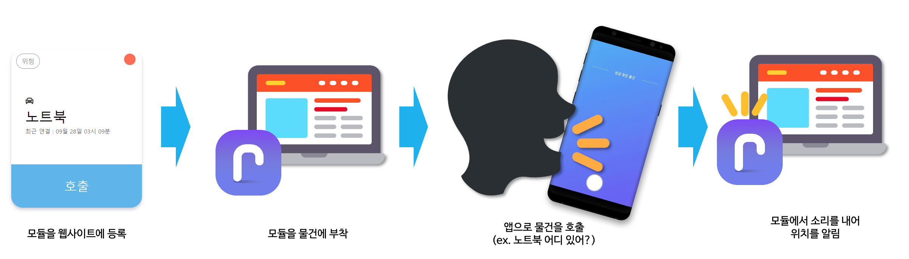

# CANETIS

시각 장애우를 위한 실내 전용 위치 알림 IoT 서비스

## CANETIS

시각 장애우를 위한 실내 전용 위치 알림 IoT 서비스

#### 상세 설명

시각 장애우는 앞을 보지 못하기 때문에 집에서 물건이 제자리에 놓여 있지 않다면 물건을 평생 찾지 못할지도 모릅니다. 이에 소리를 통해 물건의 위치를 알리고자 CANETIS를 개발하게 되었습니다.

- 시각 장애우를 위한 실내 전용 위치 알림 IoT 서비스
- Firebase의 Firestore, Functions, Messaging 활용하여 서버리스 환경 구현
- TTS & STT 기능을 활용하여 음성 기반 인터페이스 설계
- Android Accessibility Service 이용하여 접근성 도구로 앱 제어 기능 제공

