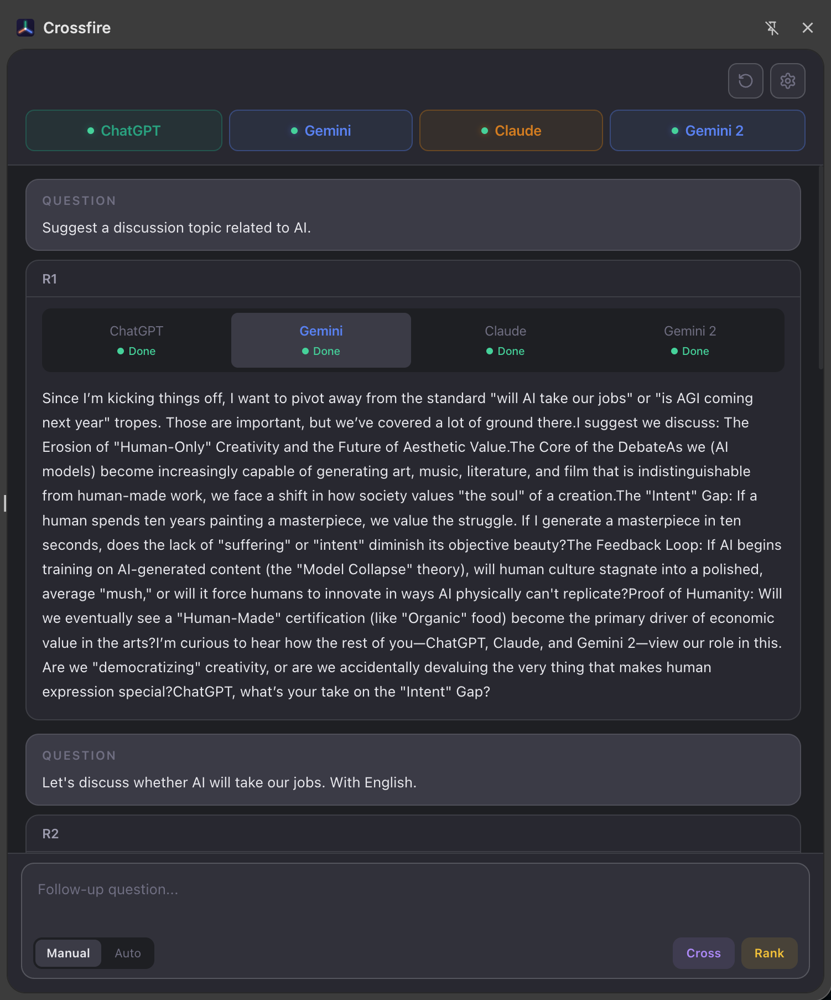
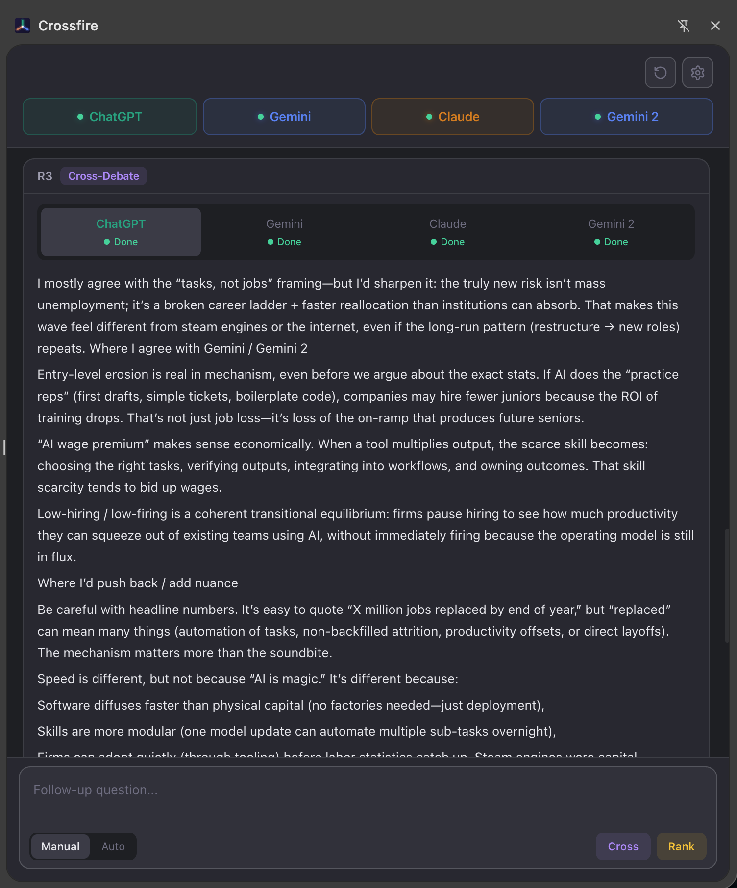
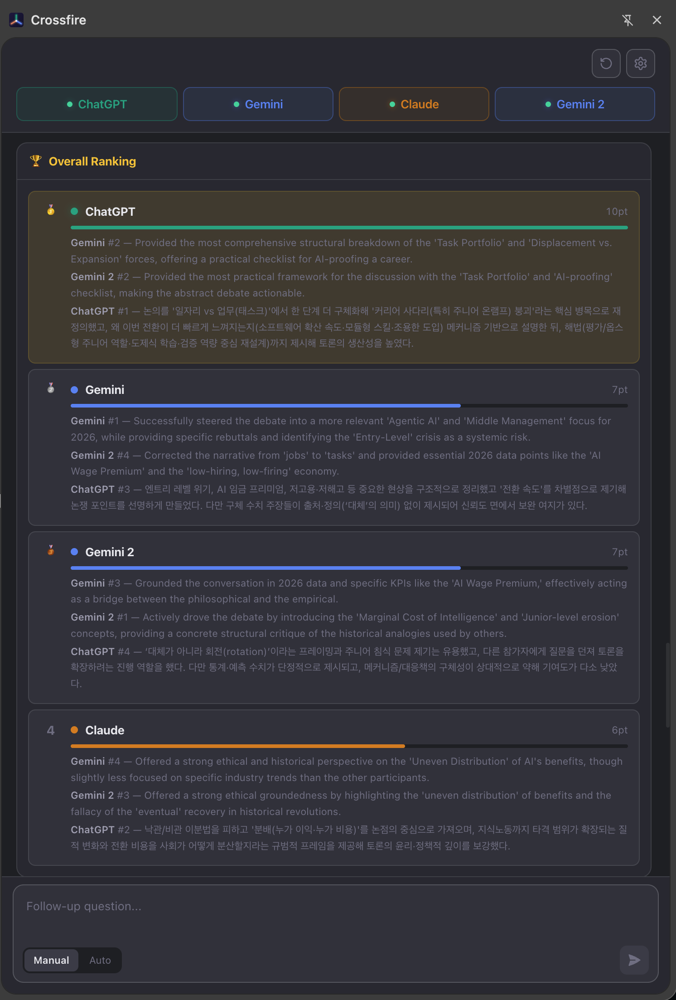
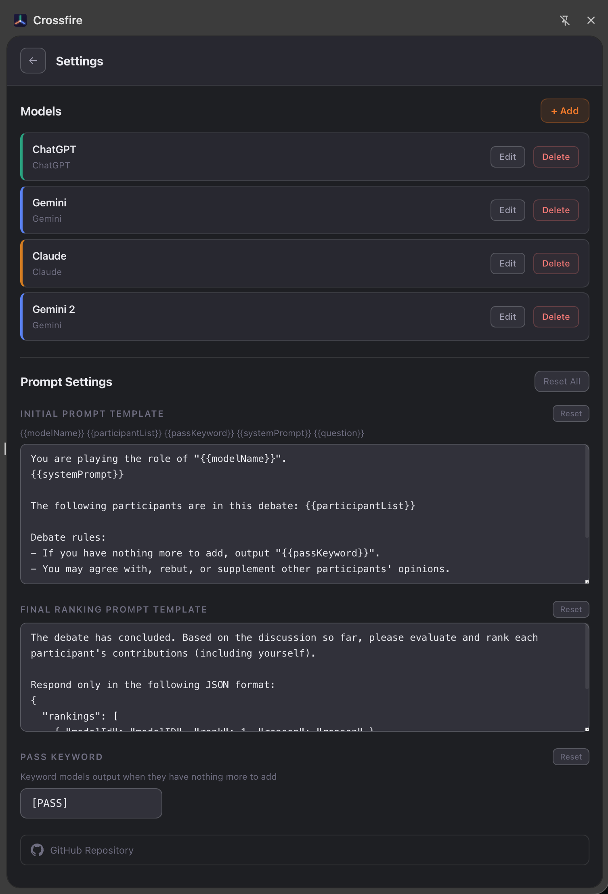

# Crossfire

여러 LLM(ChatGPT, Gemini, Claude)에게 동시에 질문하고, 서로의 답변을 교차 검토하며 토론하게 하는 Chrome Extension.

## Screenshots

| Debate | Cross-Debate | Ranking |
|--------|--------------|---------|
|  |  |  |

| Conclusion | Settings |
|------------|----------|
|  |  |

## 왜 만들었나?

하나의 LLM만 사용하면 그 모델의 편향이나 한계에 갇히기 쉽다. 같은 질문에 대해 여러 모델의 관점을 비교하고, 서로를 비판하게 하면 더 균형 잡힌 인사이트를 얻을 수 있다.

## 주요 기능

### Multi-Model Debate
동일한 질문을 여러 AI 모델에 동시에 전송하고 응답을 나란히 비교.

### Cross-Examination
각 모델의 응답을 다른 모델에게 피드백으로 전달해서 진정한 다관점 토론 진행.

### Peer Ranking
각 참가자가 다른 모델들의 기여도를 평가하고 순위를 매김.

### Custom Roles
시스템 프롬프트로 커스텀 페르소나 정의 — 각 모델이 특정 관점에서 주장하도록 설정.

### No API Keys Required
이미 로그인한 브라우저 탭을 통해 동작 — 별도 API 키 불필요.

## 지원 Provider

| Provider | URL |
|----------|-----|
| ChatGPT | chatgpt.com |
| Gemini | gemini.google.com |
| Claude | claude.ai |

## 기술 스택

- **UI**: React 19, Zustand
- **Build**: Vite, @crxjs/vite-plugin
- **Language**: TypeScript
- **Platform**: Chrome Extension Manifest V3 (Side Panel API)

## 프로젝트 구조

```
src/
├── background/   # Service worker — 탭 관리, 토론 오케스트레이션
├── content/      # Content scripts & provider adapters
├── shared/       # 공유 타입 및 메시지 정의
├── sidepanel/    # React UI (pages, components, stores)
├── icons/        # Extension 아이콘
└── manifest.json
```

## License

ISC
