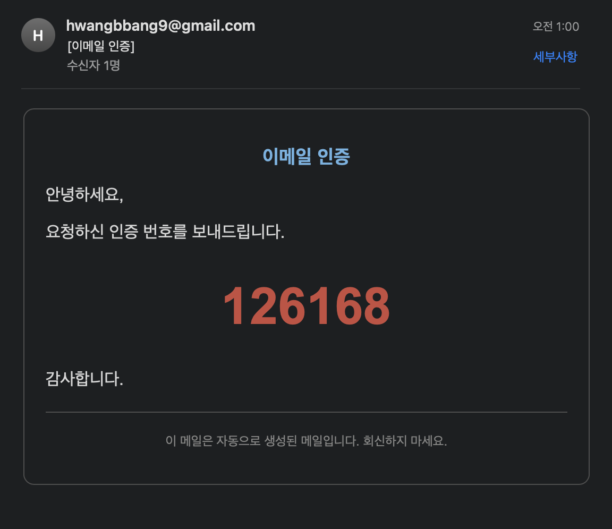
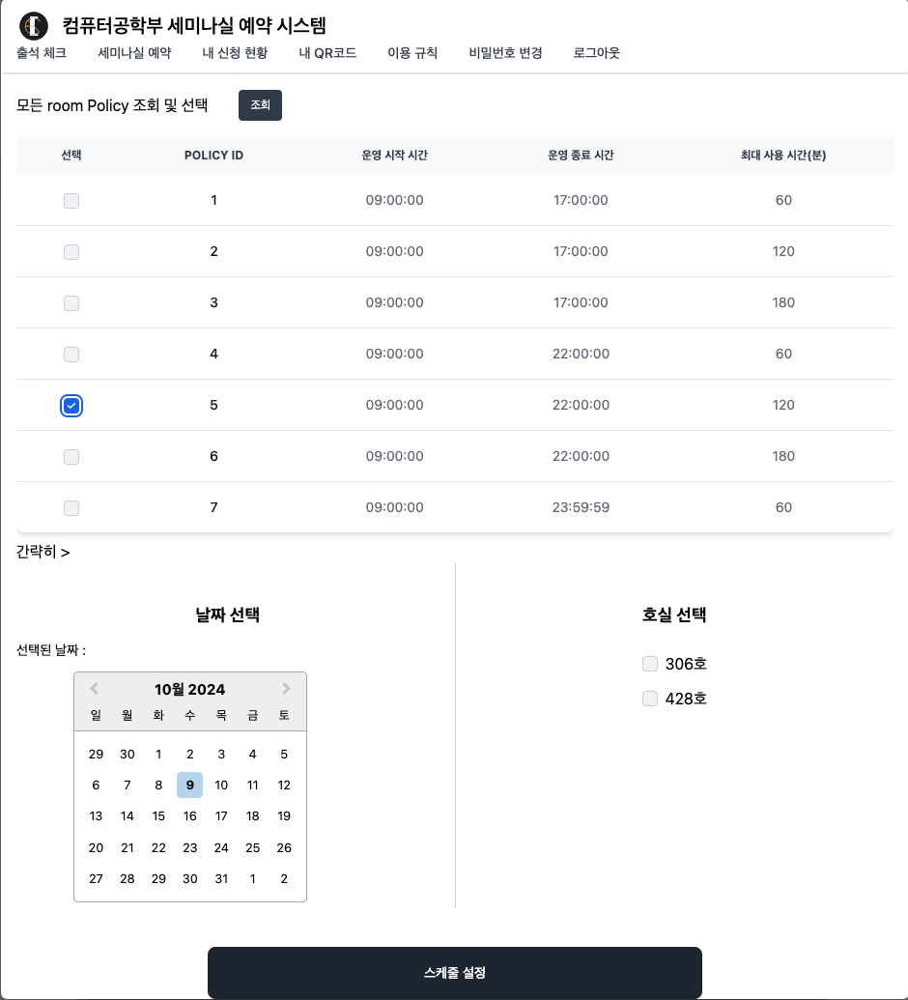
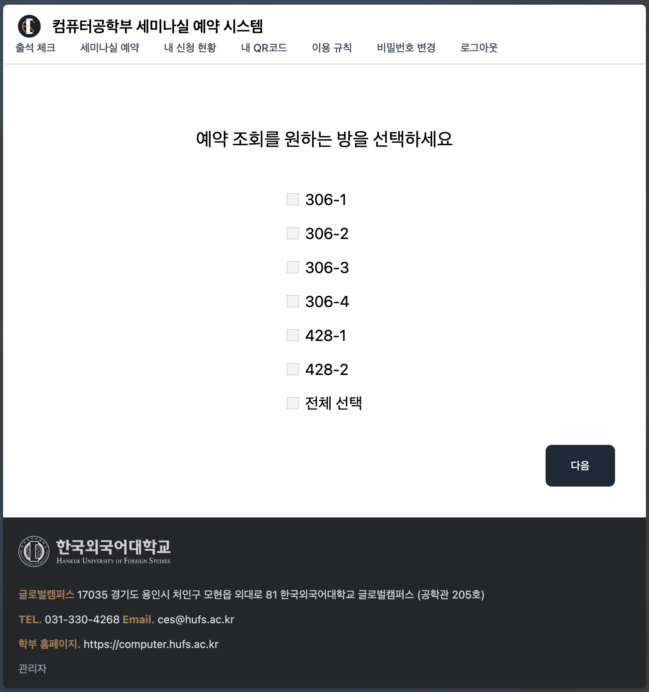

# HUFS  스터디룸 예약 시스템

‣ 

## 서비스 소개 

---

예약 현황을 조회할 수 있는 세미나실 예약 시스템 루트 페이지 

로그인 하지않은 사용자 비밀번호 재설정을 위한 본인인증

## 담당 업무

---

---

> 프로젝트 진행 타임라인

MVP 개발 : 2024.02 ~ 2024.05

유지 보수 및 테스트 : 2024.05 ~ 2024.08

서비스 도메인 확장: 2024.09 ~ 2024.10

운영 : 2024.09.02 ~ 

리팩토링: 2024.10 ~

> /icons/arrow-northeast_gray.svg 운영 페이지

> /icons/arrow-northeast_gray.svg 소개 영상 

> /icons/arrow-northeast_gray.svg Swagger UI

> /icons/arrow-northeast_gray.svg GitHub

컴퓨터 학부 학과 홈페이지 

로그인 페이지

로그인한 사용자 QR 코드 

로그인한 사용자 본인의 예약 현황 조회

로그인 하지않은 사용자 비밀번호 재설정시 본인 확인을 위한 인증 코드 발송 

로그인 하지않은 사용자 비밀번호 재설정

로그인한 사용자 비밀번호 재설정 

관리자의 스케줄 설정 

관리자의 일반 사용자 현황 관리 

관리자의 파티션별 예약 조회(1)

관리자의 파티션별 예약 조회(2)

이서연

> UI/UX 디자인 구현 : 사용자 친화적인 경험을 제공하기 위해 인터페이스를 설계하고 TailwindCSS와 React를 활용하여 직관적인 UI를 구현하였습니다.

API 연동 및 데이터 처리 : 백엔드에서 제공한 RESTful API와의 통신을 통해 예약 데이터를 효과적으로 처리하고 사용자가 실시간 예약 현황을 조회할 수 있도록 개발하였습니다.

반응형 웹 구현 : 다양한 화면 크기에서도 서비스가 원활하게 이용될 수 있도록 반응형으로 웹 페이지를 구현하였습니다.

출석체크 기능 개발 : 백엔드에서 받은 OTP 코드를 활용하여 프론트엔드에서 QR코드를 생성하고 스터디룸에 QR코드 스캐너를 설치하여 사용자가 자신의 예약에 대한 출석 체크를 할 수 있도록 하였습니다.

상태 관리 및 로그인 처리 : Recoil을 사용하여 보다 효율적인 상태 관리와 로그인 에러를 해결하였습니다.

서비스 유지보수: 프론트엔드 기능의 완성도를 높이기 위해 지속적인 테스트를 진행하였으며, 시스템 운영 중 발생하는 오류를 수정하고 새로운 요구 사항에 맞춰 기능을 업데이트했습니다.

황병훈

> 데이터베이스 설계: 시스템의 핵심 데이터 흐름을 분석하고, 효율적인 데이터 관리를 위한 DB 스키마를 설계하여 최적화된 데이터베이스 구조를 구현했습니다.

비즈니스 로직 구현: 예약, 관리, 스케줄링 등 시스템의 모든 기능을 처리하는 비즈니스 로직을 설계하고, 이를 모듈화하여 확장성과 유지보수성을 고려한 코드를 작성했습니다.

RESTful API 서버 개발: 프론트엔드와의 원활한 통신을 위한 RESTful API 서버를 개발하고, 클라이언트와 서버 간의 데이터 전송을 처리하였습니다.

CI(Continuous Integration) 환경 구축: 자동화된 빌드를 위한 CI 환경을 구축하여, 배포 효율성을 향상시켰습니다.

서비스 도입 제안 및 미팅: 학교 측과의 협의를 통해 시스템 도입을 제안하고, 학교 관계자 및 이해관계자와의 미팅을 주도하여 서비스 도입을 성사시켰습니다.

서비스 유지보수: 운영 중 발생하는 문제를 해결하고, 사용자 피드백을 반영하여 지속적인 기능 개선과 성능 최적화를 진행하고 있습니다.

김지섭 

> Infrastructure 구축: 원활한 개발 및 안정적인 서비스 운영을 위해서 모든 서비스를 Dockerize하였고, Infrastructure as a Code를 위해서 Gitops 전략을 채택하였습니다. 또한, 최종적으로 자동 배포할 수 있도록 CICD 연동작업을 진행하였습니다.

Business Logic 설계: 시간에 민감한 예약시스템에서 발생할 수 있는 문제점들과 논의사항들을 사전에 식별하여, 범용성있고 확장 가능하도록 로직의 추상화를 진행하였습니다.

각종 기술 지원: DB DDL Versioning, React runtime env injection, Declarative 설계, Gitflow 전략 등, 완성도있는 코드와 인프라를 구축할 수 있도록 개발자들에게 각종 교육을 진행하였습니다.

## 성과 

2024-10-10 기준 

## 441명

등록 유저 

## 581건 +

누적 예약 건수 

## 1건

운영 환경 도중 장애 발생 수

 서버 마이그레이션 등 작업을 진행할 때, 추후 IP주소를 자유롭게 바꿀 수 있어야 하는데, 학교측 DNS에 IP를 A 레코드로 넣게 되면, 학교측 관리자의 개입이 필요하여, 유연성을 확보하고자 자체 관리 가능한 DNS에 IP를 A 레코드로 등록하고, 이를 학교측 인프라에 CNAME으로 변경하고자 했습니다.

하지만 CNAME 등록 과정에서 마지막 . 을 누락하여, 올바른 경로로 연결되지 못했고, 문제 파악 및 DNS 재전파 시간으로 인하여 약 2시간동안 서비스 운영이 중단되었습니다.
