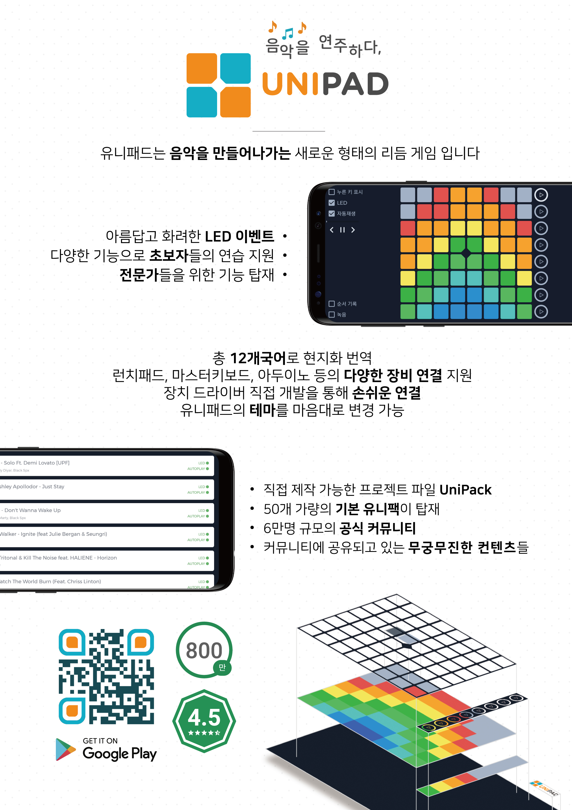

# UniPad

500+만 다운로드를 달성한 런치패드 기반의 연주형 리듬게임

1131만 다운로드를 기록한 글로벌 앱

누적 사용 수 2억 4천만 회, 평균 동접자 2000명

음악게임 부문 1위 기록, 전체게임 45위 기록

- 런치패드 기반의 연주형 리듬게임 1인 개발
- Play Store에 출시, 500만+ 다운로드 달성
- 음악게임부문 1위, 전체게임부문 50위 기록
- Task 최적화하여 초당 200회 이상의 LED Emulation 처리
- MIDI 장치 연동을 위한 자체 드라이버 인터페이스 개발
- 독자적 디자인 시스템 구축 및 라이브러리 jitpack.io에 배포
- AAC Room 이용하여 로컬 데이터베이스 구축
- LiveData, ViewModel, DataBinding 등의 아키텍처 적용
- Java to Kotlin 마이그레이션 진행
### I-DLE 초등학교 음악 수업
